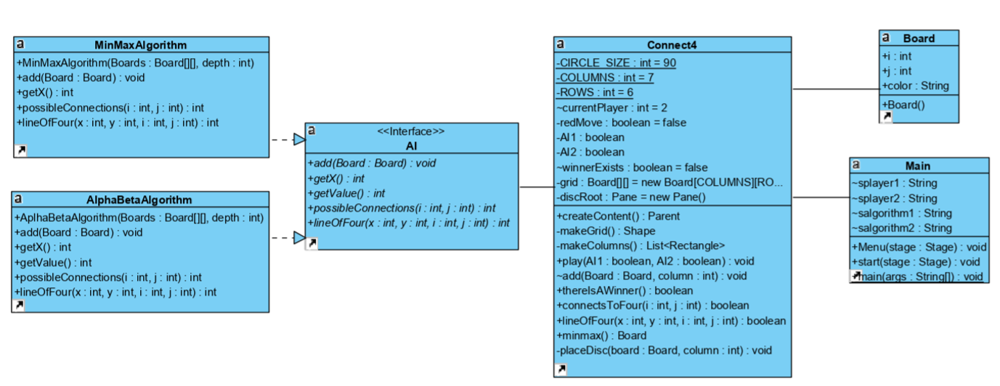
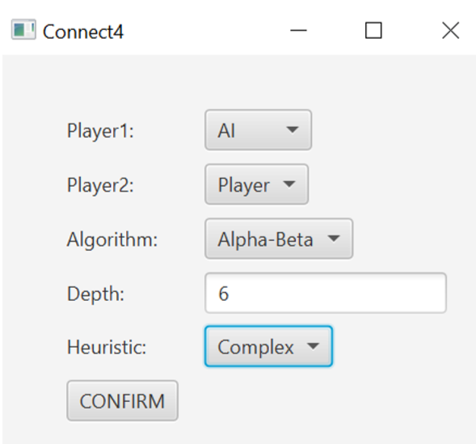
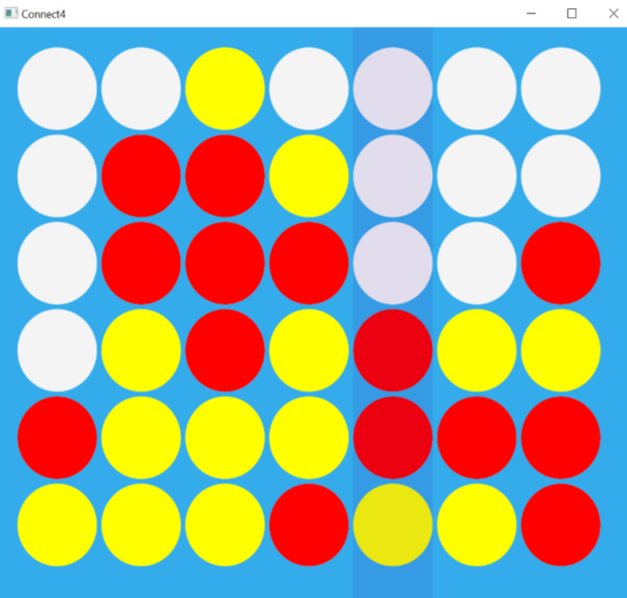
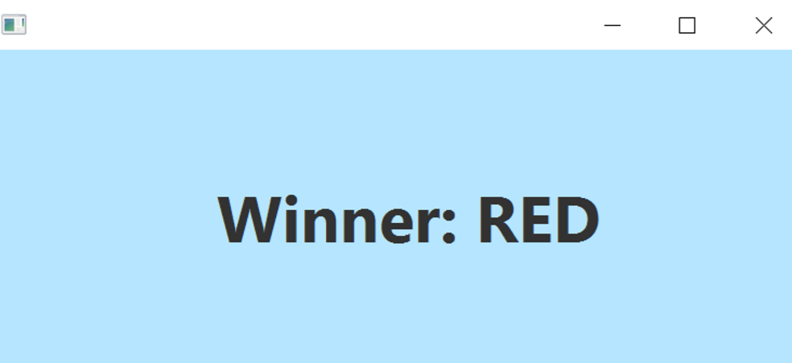

# Connect4 with AI
 Connect4 game with two AI algorithms- Min-Max and Alpha-Beta

## Table of contents
* [Class diagram](#class-diagram)
* [GUI](#gui)

## Class Diagram

## GUI

### Selection Panel
There's three options of game mode- Player vs Player, Player vs AI or AI vs AI. It is also possible to choose the algorithm, depth, and heuristics.

### Board

### Winner Announcement
